# TCPWM - PWM on the Fly Update

This code example demonstrates the update of duty cycle and frequency of a pulse width modulation (PWM) signal on the fly using Timer Counter Pulse Width Modulator (TCPWM) block.

## Device

The device used in this code example (CE) is:
- [TRAVEO™ T2G CYT2BL Series](https://www.infineon.com/cms/en/product/microcontroller/32-bit-traveo-t2g-arm-cortex-microcontroller/32-bit-traveo-t2g-arm-cortex-for-body/traveo-t2g-cyt2bl-series/)

## Board

The board used for testing is:
- TRAVEO™ T2G evaluation kit ([KIT_T2G-B-E_LITE](https://www.infineon.com/cms/en/product/evaluation-boards/kit_t2g-b-e_lite/))

## Scope of work

In this CE, the continuous change in the duty cycle and the frequency of a PWM signal is demonstrated. There are two modes:
  - Duty mode: The duty cycle of the PWM signal is updated on the fly
  - Frequency mode: The frequency of the PWM signal is updated on the fly

The modes can be switched through a UART terminal, by pressing the 'Enter' key on the keyboard.

## Introduction

**TCPWM**

The TCPWM block in TRAVEO™ T2G has the following features:
  - 16- or 32-bit counters
  - Each counter can run in one of the seven function modes:
    - Timer-counter with compare
    - Timer-counter with capture
    - Quadrature decoding
    - Pulse width modulation/stepper motor control (SMC) for pointer instruments
    - PWM with dead time/three-phase motor control
    - Pseudo-random PWM
    - Shift register mode
  - Up, down, and up/down counting modes
  - Two output trigger signals for each counter to indicate underflow, overflow, and capture/compare events
  - Supports interrupt on terminal count, capture/compare
  - Synchronous operation of multiple counters

In this CE, PWM operation mode is used.

More details can be found in the <a href="https://www.infineon.com/dgdl/Infineon-Traveo_II_Automotive_Body_Controller_Entry_Family_Architecture-UserManual-v10_00-EN.zip?fileId=5546d462766cbe860176804ea8d27e9b">Technical Reference Manual (TRM)</a>.

**TCPWM in PWM mode**

PWM functionality increments/decrements a counter between 0 and the period. When the counter is running, the counter value is compared with Compare/Capture register - CC0 or CC1 register.
When the counter value equals CC0, the cc0_match event is generated. Similarly, cc1_match event can be generated too. Additionally, on a counter overflow and counter underflow, the overflow and underflow events are generated.
Combined, cc0_match, cc1_match, overflow, and underflow events are used to generate PWM signals. Left-aligned, right-aligned, and center-aligned PWM signals can be generated.

The following registers are updated for a left-aligned PWM signal for this CE:
  - CC0 in Duty mode
  - Period in Frequency mode

    *Figure 1. PWM in duty mode and frequency mode* 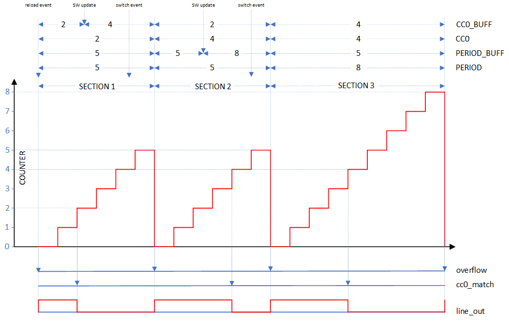

Figure 1 shows the PWM signal generated in Duty Mode and Frequency Mode and the sections are briefly explained below:
  - **Section 1**
    - Initially, there are 2 registers that are configured: *CC0* with a value of 2 and *PERIOD* with a value of 5.
      As these registers determine the duty cycle of the PWM signal in left-aligned mode, the duty cycle is 33.33% in this section.
    - Based on the mode, the registers, *CC0_BUFF* and *PERIOD_BUFF*, are written with values that would be updated in the next terminal count event.
      Since the counter runs in up-count mode, the terminal count event is an *overflow* event.
    - The *reload* event, triggered through software,  sets the counter value and starts the counter.  In up-count mode, the reload event generates
      an *overflow* event. PWM signal, indicated by *line_out*, is set to '1' when an *overflow* event occurs.
    - The *cc0_match* event occurs when the counter value matches *CC0* value, thereby setting *line_out* to 0.
    - The program writes *CC0_BUFF* register with the value 4 in the *software (SW) update* event.
    - After updating *CC0_BUFF* register, a *switch event* is triggered through software to ensure the swapping of the registers takes place in the next terminal count event.
    - After the counter value matches with the *PERIOD* value (5), the *overflow* event is generated one clock cycle later. This event also resets the counter.
      As this is the terminal count event, the registers swap their values with that of the buffer registers and the *line_out* is set to '1'.
  - **Section 2**
    - In this section, the *PERIOD_BUFF* register is written with a value of 8 in the *SW update* event.
    - The counter value matches with *CC0* value (4), generating a *cc0_match* event and sets *line_out* signal to '0'.
    - Again, *switch* event is triggered through software after updating *PERIOD_BUFF* register.
    - Later, the counter value matches with the *PERIOD* value (5), the *overflow* event is generated one clock cycle later and *line_out* is set to '1'.
      The registers are swapped again.
    - In this section, the duty cycle is 66.67%.
  - **Section 3**
    - The counter value matches with *CC0* value (4), generating a *cc0_match* event and *line_out* signal is set to '0'.
    - Later, the counter value matches with the updated *PERIOD* value (8). At the *overflow* event, *line_out* is set to '1' again.
    - In this section, the duty cycle is 44.44%.

## Hardware setup

This CE has been developed for:
- TRAVEO™ T2G Body Entry Lite evaluation kit ([KIT_T2G-B-E_LITE](https://www.infineon.com/cms/en/product/evaluation-boards/kit_t2g-b-e_lite/)) 
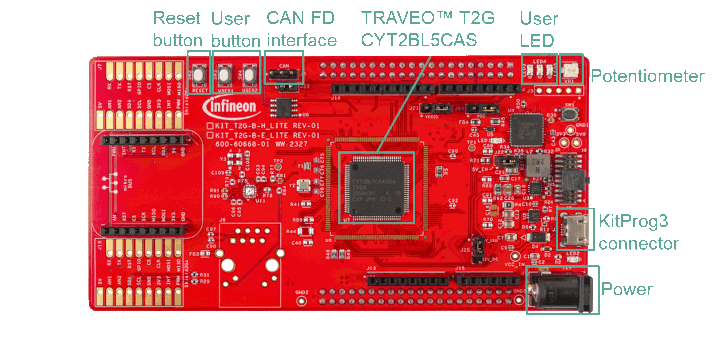 
No changes are required from the board's default settings.

An oscilloscope probe should be connected to pin P6_1 (Arduino connector J16.9) on the board to measure the PWM signal.

A UART serial connection should be made with the host via the serial port (KitProg3 connector). Use a terminal emulator to see the output on the screen. In the terminal emulator settings, select the KitProg3 COM port and set the baud rate to 115200.

## Implementation

In this CE, the PWM signal is configured using the Device Configurator.

**STDOUT/STDIN setting**

Initialization of the GPIO for UART is done in the <a href="https://infineon.github.io/retarget-io/html/group__group__board__libs.html#gaddff65f18135a8491811ee3886e69707"><i>cy_retarget_io_init()</i></a> function.
- Initializes the pin specified by *CYBSP_DEBUG_UART_TX* as UART TX and the pin specified by *CYBSP_DEBUG_UART_RX* as UART RX (these pins are connected to KitProg3 COM port)
- The serial port parameters are 8N1 and 115200 baud

**TCPWM**

In the Device Configurator,
- Group 0 Counter 0 is used for generating PWM Signal. Figure 2 shows the other parameters that is set for the PWM counter.

   *Figure 2. Device configurator - counter in PWM mode* 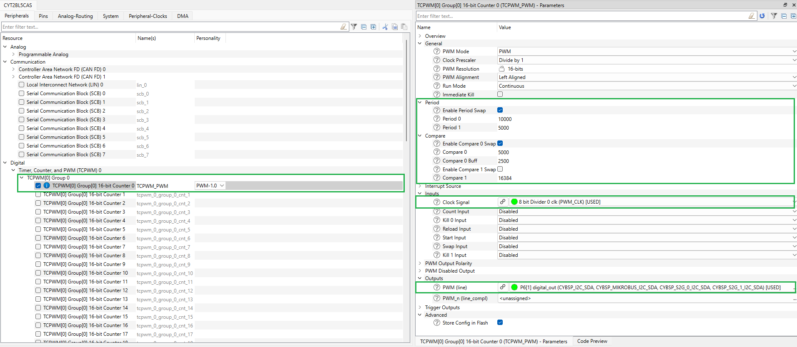

- Set the clock parameters as shown in figure 3 in the Device Configurator.

   *Figure 3. Device configurator - clock settings* 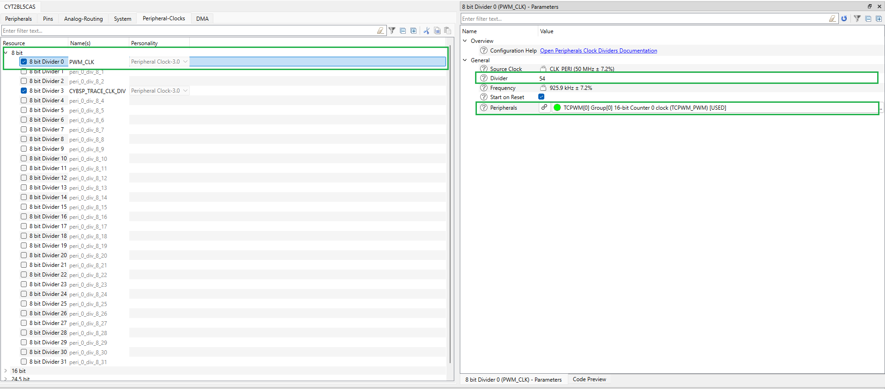

- <a href="https://infineon.github.io/mtb-pdl-cat1/pdl_api_reference_manual/html/group__group__tcpwm__functions__pwm.html#ga6440d2a9dc8d85056abd62556bee7f82"><i>Cy_TCPWM_PWM_Init()</i></a> initializes TCPWM counter in PWM mode with the configuration structure *TCPWM_PWM_config*, which is generated using Device Configurator.
- After successful initialization of TCPWM counter, it is enabled using <a href="https://infineon.github.io/mtb-pdl-cat1/pdl_api_reference_manual/html/group__group__tcpwm__functions__pwm.html#ga802ebf3a49b1056e4bc5b057deb26e49"><i>Cy_TCPWM_PWM_Enable()</i></a>.
- PWM is started by triggering a software reload event using <a href="https://infineon.github.io/mtb-pdl-cat1/pdl_api_reference_manual/html/group__group__tcpwm__functions__common.html#ga710f6bd4caaeda13df9c2ab91b8d1571"><i>Cy_TCPWM_TriggerReloadOrIndex_Single()</i></a>.

**User Input**

Using UART serial communication, terminal emulator is used to receive user input. The user can press the 'Enter' key to switch between Duty Mode and Frequency Mode.

**Code example main loop**

The endless loop of the code example in *main()* always checks whether a character has been received from the user via UART (terminal) using <a href="https://infineon.github.io/mtb-hal-cat1/html/group__group__hal__uart.html#ga89108b2d339dc9863ec660588e3a4a12"><i>cyhal_uart_getc()</i></a>.
'Enter' key is used to toggle between Duty Mode and Frequency Mode. Any other key input will be ignored. The default mode is Duty mode.

In Duty Mode:
- The period is kept constant and the duty cycle is incremented or decremented by *DUTY_STEPS_NUM*.
- If the variable *isDutyIncremented* is true, the duty cycle is incremented such that it doesn't exceed maximum period. At that point, *isDutyIncremented* is set to false.
- When *isDutyIncremented* is false, the duty cycle is decremented till minimum value. At that point, *isDutyIncremented* is set to true.

In Frequency Mode:
- The duty cycle is at a constant value of 50% and the period is incremented or decremented by *PERIOD_STEPS_NUM*.
- If the variable *isPeriodIncremented* is true, the period is incremented till it reaches the maximum defined period. At that point, *isPeriodIncremented* is set to false.
- When *isPeriodIncremented* is false, the period is decremented till minimum value. At that point, *isPeriodIncremented* is set to true.

The updated duty cycle and frequency values are stored in the variables *cc0BufferVal* and *periodBufferVal* respectively.

The period buffer register is set with the new *periodBufferVal* through the API <a href="https://infineon.github.io/mtb-pdl-cat1/pdl_api_reference_manual/html/group__group__tcpwm__functions__pwm.html#gac4bdd43ad0bbcf10d1d3a39d24e2a758"><i>Cy_TCPWM_PWM_SetPeriod1()</i></a>.
Similarly, <a href="https://infineon.github.io/mtb-pdl-cat1/pdl_api_reference_manual/html/group__group__tcpwm__functions__pwm.html#ga9c63c17045b417ecfa6e0346f9f99879"><i>Cy_TCPWM_PWM_SetCompare0BufVal()</i></a> updates the CC0 buffer register with *cc0BufferVal*.
Then, the buffer registers are swapped at the next terminal count event using <a href="https://infineon.github.io/mtb-pdl-cat1/pdl_api_reference_manual/html/group__group__tcpwm__functions__common.html#gadba9d406c3bd2b008aa7bbadcd5f32c2"><i>Cy_TCPWM_TriggerCaptureOrSwap_Single()</i></a> which acts as a switch event.
Based on the mode, the register is updated every *UPDATE_DELAY_MS* ms. It also provides sufficient time for smooth up/down count phases before the new register value is effective.

## Run and Test

For this example, TeraTerm terminal is used for displaying outputs and to send data over UART. Install a terminal emulator if you do not have one. Instructions in this document use [Tera Term](https://teratermproject.github.io/index-en.html).

After code compilation, perform the following steps for flashing the device:
1. Connect the board to your PC using the provided USB cable through the KitProg3 USB connector.
2. Open a terminal program and select the KitProg3 COM port. Set the serial port parameters to 8N1 and 115200 baud.
3. Program the board using one of the following:
    - Select the code example project in the Project Explorer.
    - In the **Quick Panel**, scroll down, and click **[Project Name] Program (KitProg3_MiniProg4)**.
4. After programming, the code example starts automatically. Confirm that the messages are displayed on the UART terminal.
5. You can debug the example to step through the code. In the IDE, use the **[Project Name] Debug (KitProg3_MiniProg4)** configuration in the **Quick Panel**. For details, see the "Program and debug" section in the [Eclipse IDE for ModusToolbox™ software user guide](https://www.infineon.com/dgdl/Infineon-ModusToolbox_3.2_b_Eclipse_IDE_User_Guide-UserManual-v01_00-EN.pdf?fileId=8ac78c8c8d2fe47b018e0ea1b42078f2).

**Note :** **(Only while debugging)** On the CM4 CPU, some code in *main()* may execute before the debugger halts at the beginning of *main()*. This means that some code executes twice: once before the debugger stops execution, and again after the debugger resets the program counter to the beginning of *main()*. See [KBA231071](https://community.cypress.com/docs/DOC-21143) to learn about this and for the workaround.

**Expected behavior**

- **Test 1: Duty Mode**
    1. The program runs with the Duty mode in the beginning. The terminal displays the current mode, in this case, Duty mode. 
    *Figure 4. Terminal display for Duty mode* 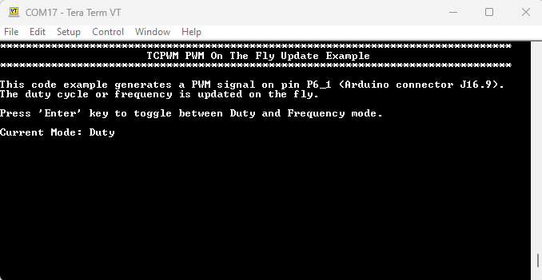  
    2. Place the oscilloscope probe on pin P6_1 (Arduino connector J16.9) and observe the waveform. The following figures shows the changes in duty cycle of the PWM signal. 
    *Figure 5. Duty mode* 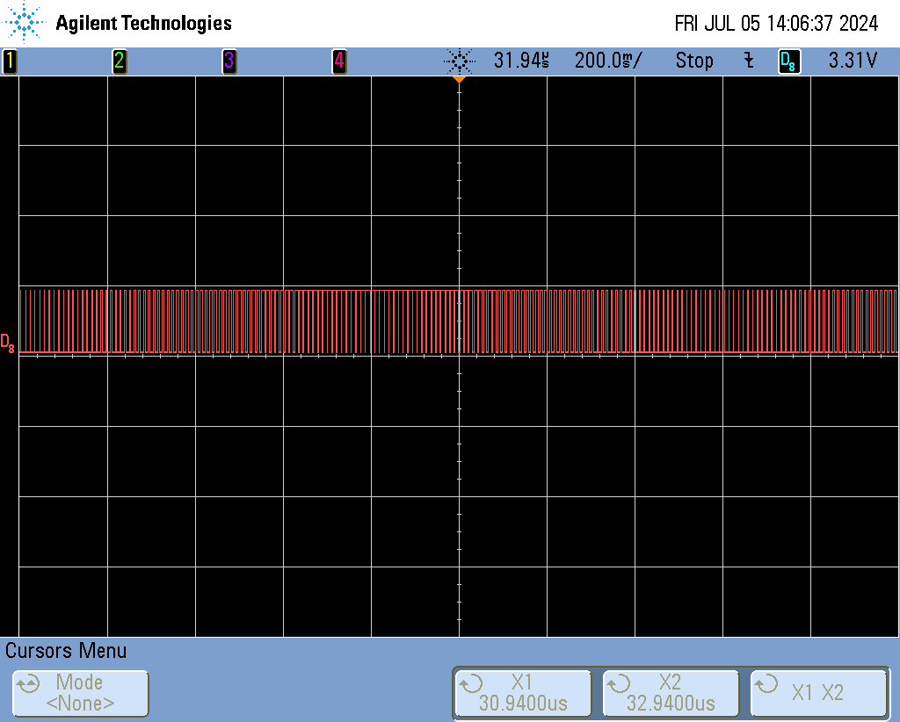  
    *Figure 6. Minimum duty cycle - 0.4%* 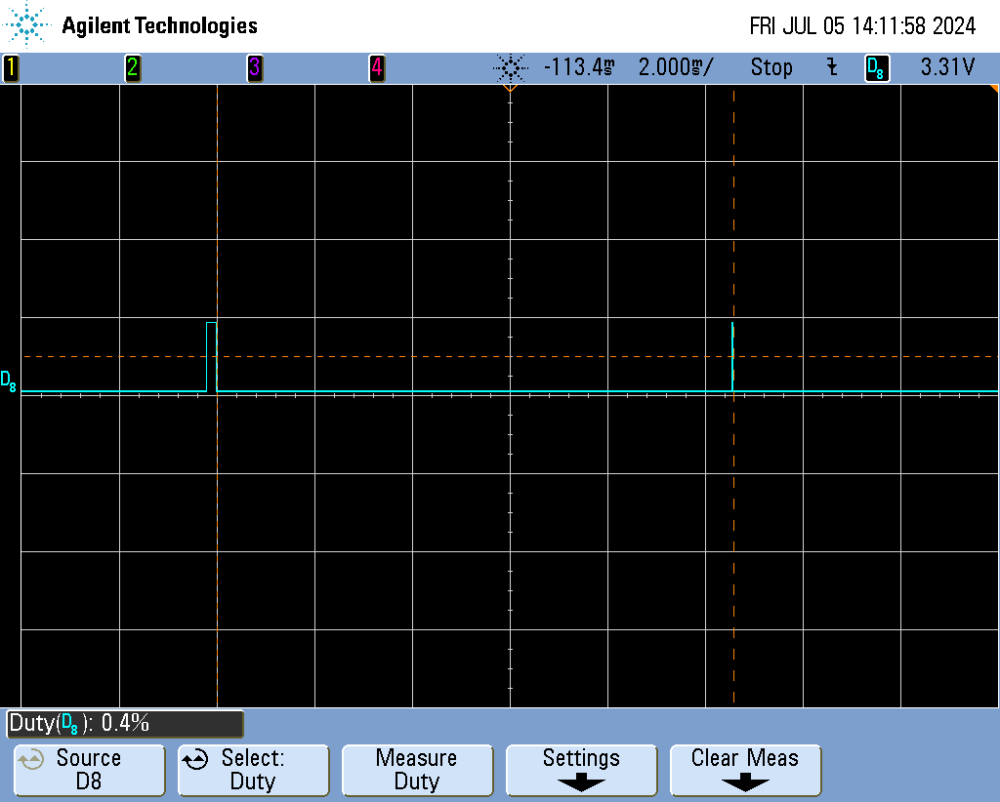  
    *Figure 7. Maximum duty cycle - 99.6%* 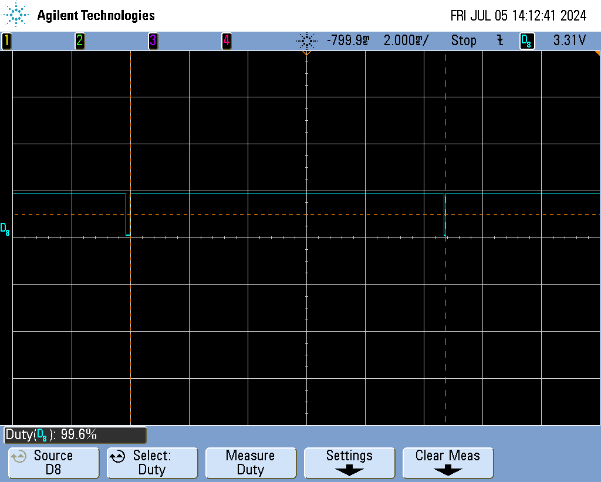   
- **Test 2: Frequency Mode**
    1. Press 'Enter' key. The terminal displays the current mode, in this case, Frequency mode.
    *Figure 8. Terminal display for Frequency mode* 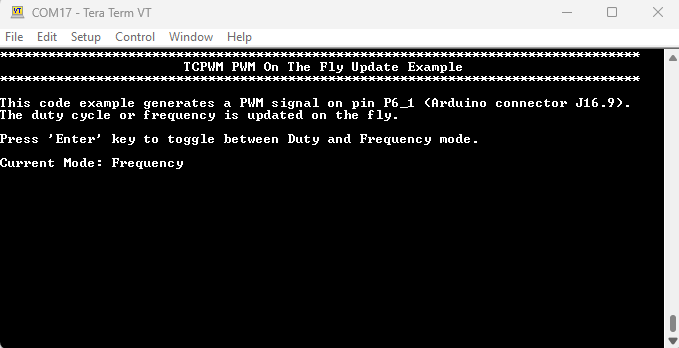  
    2. Place the oscilloscope probe on pin P6_1 (Arduino connector J16.9) and observe the waveform. The following figures shows the changes in the frequency of the PWM signal. 
    *Figure 9. Frequency mode* 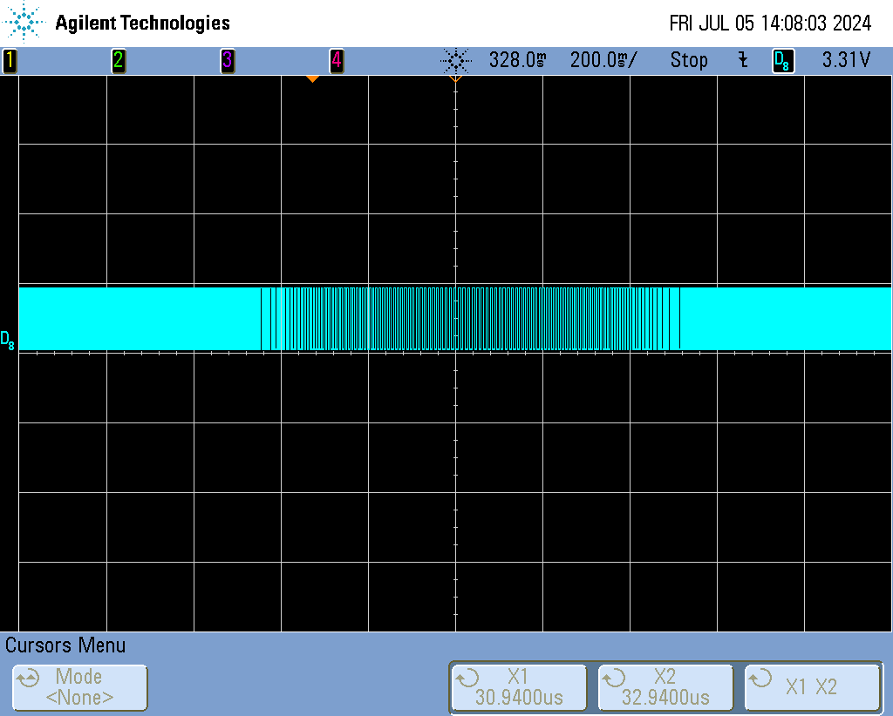  
    *Figure 10. Frequency - 18.18kHz* 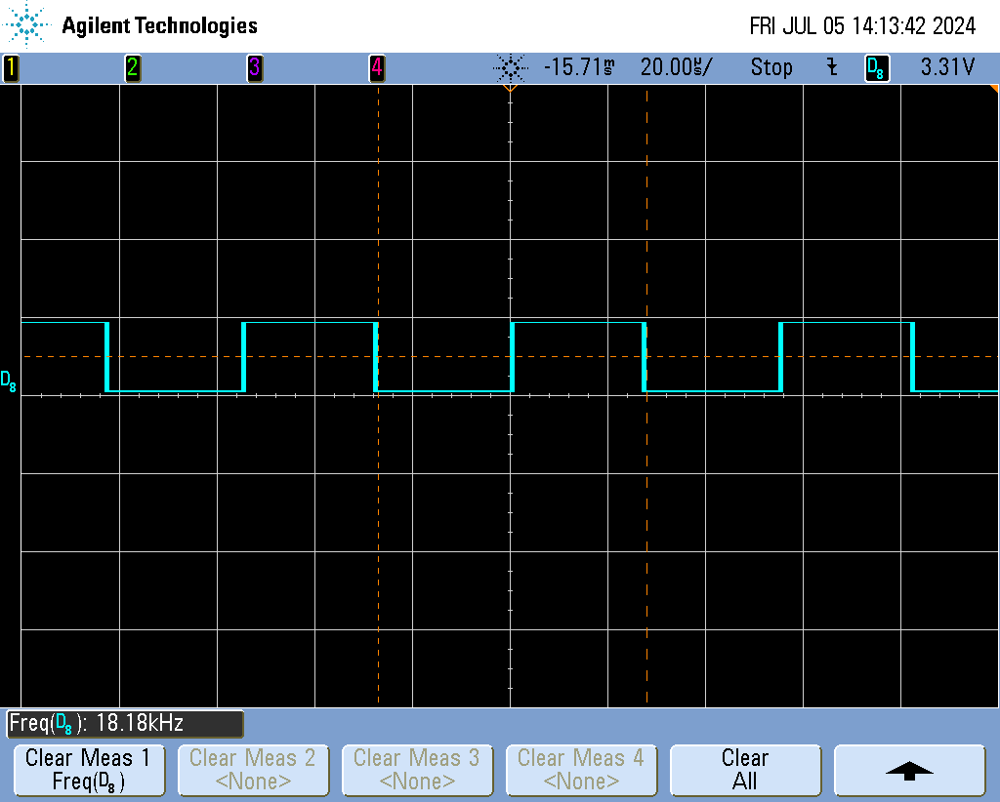  
    *Figure 11. Frequency - 94Hz* 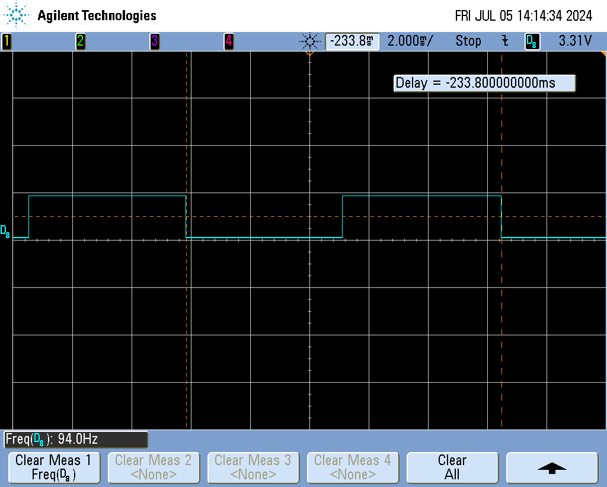  

## References

Relevant Application notes are:
- [AN235305](https://www.infineon.com/dgdl/Infineon-AN235305_GETTING_STARTED_WITH_TRAVEO_TM_T2G_FAMILY_MCUS_IN_MODUSTOOLBOX_TM-ApplicationNotes-v05_00-EN.pdf?fileId=8ac78c8c8b6555fe018c1fddd8a72801) - Getting started with TRAVEO™ T2G family MCUs in ModusToolbox™
- [AN220224](https://www.infineon.com/dgdl/Infineon-AN220224_-_How_to_use_Timer_Counter_and_PWM_TCPWM_in_TRAVEO_T2G_family-ApplicationNotes-v05_00-EN.pdf?fileId=8ac78c8c7cdc391c017d0d3a800a6752) - How to use Timer, Counter, and PWM (TCPWM) in TRAVEO™ T2G family
- [AN235303](https://www.infineon.com/dgdl/Infineon-AN235303_-_CLOCK_CONFIGURATION_SETUP_FOR_TRAVEO_TM_T2G_FAMILY_MCUS_IN_MODUSTOOLBOX_TM-ApplicationNotes-v02_00-EN.pdf?fileId=8ac78c8c8b6555fe018c1fddd05127fc) - Clock configuration setup for TRAVEO™ T2G  family MCUs in ModusToolbox™

ModusToolbox™ is available online:
- <https://www.infineon.com/modustoolbox>

Associated TRAVEO™ T2G MCUs can be found on:
- <https://www.infineon.com/cms/en/product/microcontroller/32-bit-traveo-t2g-arm-cortex-microcontroller/>

More code examples can be found on the GIT repository:
- [TRAVEO™ T2G Code examples](https://github.com/orgs/Infineon/repositories?q=mtb-t2g-&type=all&language=&sort=)

For additional training, visit our webpage:
- [TRAVEO™ T2G training](https://www.infineon.com/cms/en/product/microcontroller/32-bit-traveo-t2g-arm-cortex-microcontroller/32-bit-traveo-t2g-arm-cortex-for-body/traveo-t2g-cyt4bf-series/#!trainings)

For questions and support, use the TRAVEO™ T2G Forum:
- <https://community.infineon.com/t5/TRAVEO-T2G/bd-p/TraveoII>
